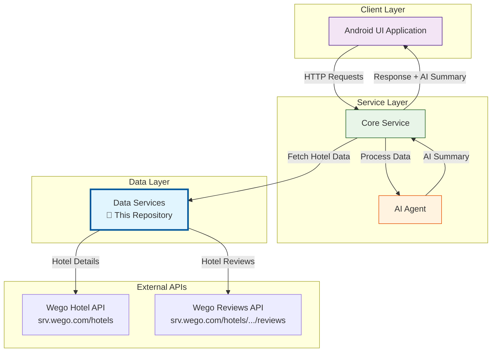

# Data Services - Wego Hackathon Project

> 🏆 Data services component for the Wego Hackathon Contest by Team One Piece

## 📋 Project Overview

This is a **Spring Boot microservice** that serves as the data layer in a 3-tier architecture designed for Wego's hackathon contest. The service provides hotel information and reviews data to support AI-powered hotel summarization features.

### 🎯 Purpose
- Fetch hotel details and reviews from Wego's external APIs
- Provide structured data to the core service layer
- Support AI-driven hotel recommendation and summarization features

## 🏗️ System Architecture



## 🚀 Features

- **Hotel Information API**: Fetch comprehensive hotel details including location, amenities, contact information
- **Reviews Aggregation**: Collect and process hotel reviews from multiple sources
- **Data Transformation**: Convert external API responses to standardized internal models
- **Error Handling**: Robust error handling for external API failures
- **MapStruct Integration**: Efficient object-to-object mapping

## 🛠️ Technology Stack

- **Framework**: Spring Boot 3.5.3
- **Java Version**: Java 23
- **Build Tool**: Maven
- **Key Dependencies**:
  - Spring Web (REST APIs)
  - Lombok (Boilerplate reduction)
  - MapStruct (Object mapping)
  - RestTemplate (HTTP client)

## 📡 API Documentation

### Get Hotel Data
Retrieve comprehensive hotel information including details and reviews.

```http
GET /api/hotel/{hotel_id}
```

#### Parameters
| Parameter | Type | Description |
|-----------|------|-------------|
| `hotel_id` | Integer | Unique identifier for the hotel |

#### Response Format
```json
{
  "reviews": [
    "Amazing location with great service...",
    "Clean rooms and friendly staff...",
    "..."
  ],
  "hotel_info": {
    "id": 12345,
    "nameEn": "Grand Hotel Example",
    "address": "123 Main Street",
    "description": "Luxury hotel in the heart of the city",
    "latitude": 1.2345,
    "longitude": 103.6789,
    "star": 5,
    "checkIn": "15:00",
    "checkOut": "12:00",
    "email": "info@grandhotel.com",
    "phone1": "+65-1234-5678",
    "city": {
      "name": "Singapore",
      "nameEn": "Singapore"
    },
    "district": {
      "name": "Marina Bay",
      "nameEn": "Marina Bay"
    }
  }
}
```

#### Response Fields

**reviews**: Array of review comments as strings
**hotel_info**: Detailed hotel information object containing:
- Basic info (id, name, description, address)
- Location data (latitude, longitude, city, district) 
- Contact details (email, phone, fax)
- Property details (star rating, room count, floors)
- Check-in/out policies
- Built year and other metadata

## 🏃‍♂️ Getting Started

### Prerequisites
- Java 23 or higher
- Maven 3.6+
- Internet connection (for external API calls)

### Installation & Running

1. **Clone the repository**
   ```bash
   git clone <repository-url>
   cd data-services
   ```

2. **Build the project**
   ```bash
   ./mvnw clean compile
   ```

3. **Run the application**
   ```bash
   ./mvnw spring-boot:run
   ```

4. **Verify the service**
   ```bash
   curl http://localhost:8080/api/hotel/123456
   ```

The service will start on `http://localhost:8080` by default.

## 🧪 Testing

Run the test suite:
```bash
./mvnw test
```

## 📁 Project Structure

```
src/
├── main/
│   ├── java/com/onepiece/data_services/
│   │   ├── config/           # Application configuration
│   │   ├── controller/       # REST controllers
│   │   ├── mapper/          # MapStruct mappers
│   │   ├── model/           # Data models and DTOs
│   │   ├── service/         # Business logic services
│   │   │   └── impl/        # Service implementations
│   │   └── DataServicesApplication.java
│   └── resources/
│       └── application.properties
└── test/                    # Test classes
```

## 🔧 Configuration

The application can be configured via `application.properties`:

```properties
spring.application.name=data-services
# Add other configuration as needed
```

## 🔗 External Dependencies

This service integrates with Wego's APIs:
- **Hotel Details API**: `https://srv.wego.com/hotels/hotels/{hotelId}`
- **Reviews API**: `https://srv.wego.com/hotels/v2/hotels/{hotelId}/reviews/search`

## 🚀 Deployment

### Local Development
```bash
./mvnw spring-boot:run
```

### Production Build
```bash
./mvnw clean package
java -jar target/data-services-0.0.1-SNAPSHOT.jar
```

## 🤝 Contributing

This project is part of the Wego hackathon contest. For questions or contributions:

1. Follow the existing code style and patterns
2. Ensure all tests pass before submitting
3. Add appropriate documentation for new features

## 👥 Team

**Team One Piece** - Wego Hackathon 2024

## 📄 License

This project is developed for the Wego Hackathon contest.

---

*Built with ❤️ for Wego Hackathon by Team One Piece* 